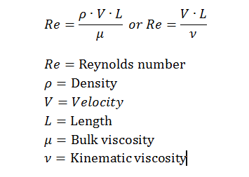

### Python Programming for Water Resources Engineering and Research.


*<sub>Drinking water treatment plant at Constance Lake. (Source: V.E.Q.D. 2020). </sub>*

***

# DESIGNING AN USER INTERFACE FOR THE WATER DISTRIBUTION SYSTEM OF A TOWN.

>	***Background***: Drinking water distribution systems are based primarily
> on the consumption of the population to be supplied. Other elements of the 
> system are derived from this parameter, such as the dimensions of the pipes,
> the number of pumps needed and the arrangement of the pumps that will allow 
> supplying the demand.

>	***Goals***: Using functions, classes and objects. Show up through a
> Graphical User Interface (GUI), the main elements of a water distribution
> system, such as: consumption according to the country, daily flow, hourly 
> flow, and pipe dimensions. Likewise, by means of plots, it will be shown 
> the number of pumps and the arrangement (parallel, series or combined) 
> necessary to supply the demand.

>   ***Requirements***: *Python* libraries: *os*, *logging*, *math*, 
> *matplotlib*, *openpyxl*, *numpy* and *pandas*. *Python* module: *tkinter*.


Please clone the code here:

```
git clone https://github.com/hadi1976/python_project.git
```

# Theory
***

## Flow discharge.

The design of drinking water distribution systems, is based on the quantity of 
water to be distributed. In this sense, the first data that has to be taken in 
consideration is the consumption per capita, according to the country. 
For the purposes of this project, the consumption per capita in the countries 
considered, are shown in Table 1.

| **Country**    | **Consumption (lit/cap. day)**| 
|----------------|--------------------------------
| Belgium        | 1515 |
| Bulgaria       | 2142 |   
| Czech Republic | 422  |   
| Denmark        | 318  |   
| Germany        | 855  |   
| Estonia        | 3580 |   
| Ireland        | 461  |   
| Greece         | 2373 |   
| Spain          | 1924 | 
| France         | 1244 | 
|Croatia         | 406  | 
| Italy          | 1546 | 
| Cyprus         | 742  | 
| Latvia         | 311  |   
| Lithuania      | 2665 |   
| Luxembourg     | 208  |   
| Hungary        | 1403 |   
| Malta          | 395  |   
| Netherlands    | 1447 |   
| Austria        | 1138 | 
| Poland         | 763  | 
| Portugal       | 2371 | 
| Romania        | 882  | 
| Slovenia       | 1172 |   
| Slovakia       | 269  |   
| Finland        | 3407 |   
| Sweden         | 785  |   
*<sub>Table 1. Consumption in lit/cap. day in some countries. (Source: Euro Stat) </sub>*

With this information and the number of inhabitants, it is possible to know the 
average flow required by a community, according to its consumption. Thus, the
demand would be supplied.

However, according to the design standards, a water distribution system
is based on two types of flow:

1. Hourly flow rate (Qhmax): Corresponds to the distribution pipe and is governed by 
the hours of consumption of the inhabitants. The hourly flow rate is calculated
using the following formula:

> ***Qhmax*** = [(Consumption/24 hours) · Inhabitants] / daily factor (f)

2. Daily flow rate (Argmax): Corresponds to the transmission pipe, which 
connects the source with the storage tank. In this case, the tank will act as a
buffer and will allow the change of distribution according to the hourly 
consumption. Tha daily flow is calculated by the following formula:

> ***Qdmax*** = [Consumption · Inhabitants]/ hourly factor (f)


*<sub> Figure 1. Representation of the water distribution system. (Source: Lecture, 
Water Demand, Supply and Distribution ) </sub>*

## Pipe dimensioning.

As can be seen in Figure 1, this system will be conformed by two pipes: 
*transmission pipeline* and *distribution pipeline*. 

For these two pipes, even when the flow used for its designing is different. 
The dimensioning procedure follows the same parameters:

### 1. Diameter and Velocity.

This information will be obtained from the economic diameter table:

| **Flow discharge (lit/sec)** | **Diameter (mm)** | **Velocity (m/s)** |  
|------------------------------|-------------------|--------------------|
| 6                            | 100               | 0.80               |          
| 10                           | 125               | 0.80               | 
| 15                           | 150               | 0.85               | 
| 28                           | 200               | 0.90               | 
| 47                           | 250               | 0.95               | 
| 70                           | 300               | 1.00               | 
| 140                          | 400               | 1.10               | 
| 240                          | 500               | 1.20               | 
| 370                          | 600               | 1.30               | 
| 540                          | 700               | 1.40               | 
| 800                          | 800               | 1.55               | 
| 1350                         | 1000              | 1.75               | 
*<sub>Table 2. Available commercial diameters and approximate velocities, according to the flow discharge. 
(Source: Lecture, Water Demand, Supply and Distribution) </sub>*

With this table, according to the flow rate in (lit/sec), an available commercial diameter in (mm)
will be assigned, likewise, the velocity in (m/s). In this case, will always be 
taken the diameter of the largest flow, closest to the calculated flow value. 

### 2. Reynolds Number.

This number is used to classify the flow passing through the pipes. It can be:
* Turbulent  R > 3000
* Transition 3000 > R > 2000
* Laminar R < 2000

The Reynolds number is calculated with the following formula:



*<sub> Figure 2. Formula for calculating the Reynolds number. (Source: 
Paul Mueller Company Akademie) </sub>*

### 3. Friction coefficient. 

Is the amount of load lost in the pipe due to the friction.

The friction coefficient is calculated according to the Colebrook formula:


*<sub> Figure 3. Colebrook formula. (Source:JMCampbell) </sub>*

### 4. Slope

The necessary inclination for the water to run through the pipe without 
inconveniences. Is expressed in (%).

The slope is calculated in the following way:

> ***Slope*** = fiction coefficient · [Velocity/ 2·gravity · diameter  ] · 10000

*<sub>Source: Lecture, Water Demand, Supply and Distribution. </sub>*

### 5. Head loss 

The amount of energy that is lost along the pipe. Not only due to friction, but 
also includes  minor losses. The head losses are given in (m)

The head loss is calculated by the following formula:

> ***Head loss*** = [slope/pipe length] · 1000

*<sub> Source: Lecture, Water Demand, Supply and Distribution </sub>*

## Pump type and arrangement.

Finally, in order to the water to reach the storage tank, through  the
*transmission pipeline*, it is necessary to use pumps. In this case, the *daily
flow rate* is the one taken into account.

At this point, is important to mention that the system proposed in this 
project, contemplates that from the storage tank, the water will reach the town
by gravity, through the *distribution pipeline*.

In this case, the designed program has two models of pumps:

* Model 2009 1760 RPM. *Observe curves performance in Figure 4.*
* Model 8013 1760 RPM. *Observe curves performance in Figure 5.*


*<sub> Figure 4. Curves performances for the Model 2009 1760 RPM. Source:
The pump performance is based on Taco Pumps.</sub>*


*<sub> Figure 5. Curves performances for the Model 8013 1760 RPM. Source: 
 The pump performance is based on Taco Pumps. </sub>*

According to the information given by the user, the program will suggest a
pump model and performance curve that will meet the demand. This is going to
be shown to the user as follows:


*<sub> Figure 6. Best fit performance curve for the Model 2009 1760 RPM. Source: 
**The plot is generated by the program. The pump performance 
is based on Taco Pumps.** </sub>*

In the case that is illustrated in Figure 6, the program is showing to the user
that the Model 2009 1760 RPM, with the performance of 5HP, will supply the 
demand.

Nonetheless, if the user enters data that exceeds the maximum capacity offered 
by the suggested models. The program will propose to the user some pumps 
arrangements that will allow to supply the demand. 

###1. Parallel arrangement.


*<sub> Figure 7. Curves performances for the Model 8013 1760 RPM, arranged 
in parallel. Source:**The plot is generated by the program. The pump 
performance is based on Taco Pumps.** </sub>*

This will occur if the storage tank elevation provided by the user is greater 
than the maximum capacity of the pump with the highest performance. But, the
flow rate does not exceed the capacity of that pump.

###2. Series arrangement.


*<sub> Figure 8. Curves performances for the Model 8013 1760 RPM, arranged 
in series. Source:**The plot is generated by the program. The pump 
performance is based on Taco Pumps.** </sub>*

This will occur if the consumption value of a country or the amount of 
population causes a *daily flow* rate greater than the maximum capacity of the 
pump with the highest efficiency. But the storage tank is at lower elevation 
than the maximum height performance of that pump.

###3. Combined arrangement.


*<sub> Figure 9. Curves performances for the Model 8013 1760 RPM, arranged 
in series. Source:**The plot is generated by the program. The pump 
performance is based on Taco Pumps.** </sub>*

This will occur if both the *daily flow* and the storage tank elevation exceed 
the maximum capacity of the available pump models. In this case, the program 
will give the option of performing a staged (series) arrangement until the
desired flow rate is reached, and from the last stage on, it will proceed to 
order in parallel, until the desired flow rate is reached.

>***Note:*** for observing this kind of graphs in the output, please be sure
> that the number of inhabitants introduced is not so high. In this case, it will
> be needed so many pumps arranged in series and parallel and due to the
> lack of space in the graph, it can not be appreciated properly. However, in the GUI, can be read
> the explanation with the amount of pumps and the arrangements done by de program.


***

##Code

## Set the frame

This code is based on classes, that are created in different scripts. From 
these classes, the objets will be referenced, in more than one script,
according to the class function. However, at the end of the chain, this
custom classes and objects will be called in the `main.py` which will finally 
send the outputs as `returns` from the different `functions` to the script 
`GUI.py` where is the *stand alone* that will run the program.

The **additional scripts** are described in the following lines:

* `diameters.py` will contain the `DiameterReader` that has the function to read 
the *EconomicDiameter.csv* file. Making  it reusable for others water 
distribution designing codes.


* `flowrate_factors.py` will contain functions for obtaining 
country consumption*, *hourly flow* and *daily flow*.


* `performances.py` will contain functions for evaluating the performances
of the two pumps. Will define which pump fits to the user demands.


* `pipes.py` will contain the `TypeOfPipe` class that is going to dimension the
distribution and transmission pipe. It will use the class `DiameterReader`
previously described.


* `pumps_fugre.py` have two classes `FlowRatePump`and `HeadPump`. These classes 
create the equations that describes the two pumps model performances.


* `plots.py` Is based on five functions, that will plot the type of pump and
pumps arrangement according to the user inputs. It will use the classes 
`FlowRatePump` and `HeadPump`, previously described.


* `config.py` has all the libraries and modules imported. Also, the path of the
inputs from the user interface. In this script is enabled the logging function.

The classes and functions are going to be created according to the following 
chart:


> ***Note:*** For appreciating the chart with a better quality. Please go to 
> folder *readme_pics* and select the figure: *imgchart.png*.
### Inputs and Outputs
***1. Inputs***

* `country`: as a *str* variable that will be picked from the combo box.


* `inhabitants`: as an *int* of the number of people for which the system is
going to be designed. Since the code is designed for small towns, the number
of inhabitants introduced, should not exceed ***1 000 000*** of inhabitants.


* `user_elevation`:as an *int* of the storage tank elevation in (m).


* `transmission_pipe_length`: as an *int* that will be the length of the
transmission pipeline in (m).


* `distribution_pipe_length`:as an *int* that will be the 
 length of the distribution pipeline in (m).

***2. Outputs:***

* `Consumption per country`:as an *int* of the water consumption per capita
in the selected country in (lit/sec.cap).


* `Hourly flow discharge`:as a *float* of the flow discharge in the distribution
pipeline in (lit/sec).


* `Daily flow discharge`:as a *float* of the flow discharge in the transmission
pipeline.


**Pipe dimensions for the *transmission pipeline* and the *distribution pipeline*:**
* `Diameter`: as an *int* of the pipe diameter in (mm).


* `Velocity`: as a *float*mof the pipe velocity in (m/s).


* `Reynolds number`: as a *float* for the pipe Reynolds number.


* `Friction coefficient`:as a *float* of the pipe friction coefficient.


* `Slope`:as a *float* of the pipe slope in (%). 

* `Head loss`: as a *float* of the pipe head loss in (m).

**Pumps type and arrangement:**

* `Type of pump and arrangement`:as a *str* for the model and arrangement
of pumps.


* `Type of pump and arrangement`:as a *plot* for the model and arrangement of pumps.

### Stand-alone - Graphical User Interface (GUI) 

*In this file it was made a stand-alone GUI which takes all the inputs from the user,
save it in a text file, and show the results.*
```Python
class MyApp(tk.Frame):
  def __init__(self, master=None):
        tk.Frame.__init__(self, master)
```
 *The method `save_country_name()`would insert the user's country in a txt file name, country.txt
 So, when the user click on Assign button the country name wil be written in
 text file.*
```Python
    def save_country_name(self):
        return None
   ```
*The method `save_info1()` would insert the user's number of inhabitants in a txt file name,
Input1.txt .So when the user click on Assign button the input wil be written
in text file.*
```Python
    def save_info1(self):
        return None
```
*The method `save_info2()` would insert the user's elevation town in a txt file name,  
Input2.txt .So when the user click on Assign button the input will be written 
in text file.*
```Python
    def save_info2(self):
        return None
````
*The method `save_info5()` would insert the user's pipe length between the tank
and town in a txt file name, Input5.txt .So when the user click on Assign
button the input will be written in text file.*

```Python
    def save_info5(self):
        return None
```
*The method `save_info6()` would insert the user's pipe length between the tank
and town in a txt file name, Input6.txt .So when the user click on Assign
button the input will be written in text file.*

```Python 
    def save_info6(self):
        return None
```
*In the method `check_inputs()` when the user click on the respective button(Check your Inputs).
The program navigate to the text files were all the inputs are saved. And It 
shows the values that the user has entered.*

```Python
    def check_inputs(self):
        return None
        
````
*In the Method `show_results()` when the user click on the respective button(Show results), 
It would import all the outputs that we want from this project, e.g. 
The consumption value, The hourly flow discharge, Diameter of the pipe,etc.* 

```Python 
    def show_results(self):
        return None
```
*Stand-alone bottom for running the code.*

>**The code should be run from this function in `GUI.py`**

```Python
if __name__ == '__main__':
    MyApp().mainloop()
```
> ***Note:*** Please take in consideration the following restrictions and
> information for the correct handling of the GUI: 
> 
> 1.The GUI, will operate according to the expected when introducing the values for
> the first time. For introducing new values and obtaining new outputs, the code
> should be run again.
> 
> 2.Is important to make sure, that the bottom *Assign* has been activated on
> every input. Otherwise, the GUI will not show the expected outputs.
>
> 3.The bottom *Show pumps* will show the plots with the performance curves of 
> the two pumps model.


### Main 

The script `main.py` has the function of integrating the outputs from all 
the codes, through the implementation of functions. These functions are going 
to be called in the "GUI.py" code.


*The function `consumption()` returns the **int** of the consumption depending on the selected country in
(lit/sec.Capita).*
```Python
def consumption():
    country_consumption = flowrate_factors.get_flow_discharge()
    return country_consumption
````
*The function`hourly()`returns the **float** of The flow discharge per hour in (lit/hour).*
```Python
def hourly():
   
    flow_hourly = flowrate_factors.max_hourly_flow()
    return "%.2f" % flow_hourly
````
*The function `daily()` returns the **float** of flow discharge per day in (lit/day).*
```Python
def daily():
  
    flow_daily = flowrate_factors.max_daily_flow()
    return "%.2f" % flow_daily
````
*The function `diameter_transmission()` returns the **int** of the transmission 
pipeline diameter in (mm).*
```Python
def diameter_transmission():

    return str(transmission_dim[4])
````
*The function `velocity_transmission()` returns the **float** of the transmission
pipeline velocity in (m/s).*

```Python
def velocity_transmission():
    return str(transmission_dim[5])
```
*The function `reynolds_transmission()` returns the **float** of the transmission
pipeline Reynolds number.*
```Python
def reynolds_transmission():
    return "%.2f" % transmission_dim[0]
````
*The function `friction_transmission()`returns the **float** of the transmission 
pipeline friction coefficient.*
```Python
def friction_transmission():
    return "%.2f" % transmission_dim[1]
````
*The function `slope_transmission()`returns the **float** of the transmission 
pipeline slope in (%).*
```Python
def slope_transmission():
    return "%.5f" % transmission_dim[2]
```
*The function `loss_transmission()` returns the **float** of the transmission 
pipeline head loss in (m).*
```Python
def loss_transmission():
    return "%.5f" % transmission_dim[3]
```
*The function `diameter_distribution()`returns the **int** of the distribution
pipeline diameter in (mm).*
```Python
def diameter_distribution():
    return str(distribution_dim[4])
```
*The function `velocity_distribution()` returns the **float** of the distribution
pipeline velocity in (m/s).*
```Python
def velocity_distribution():
    return str(distribution_dim[5])
```
*The function `reynolds_distribution()`returns the **float** of the distribution
pipeline Reynolds number.*
```Python
def reynolds_distribution():
    return "%.2f" % distribution_dim[0]
```
*The function `friction_distribution()` returns the **float**  of the distribution 
pipeline friction coefficient.*
```Python
def friction_distribution():
    return "%.2f" % distribution_dim[1]
```
*The function `slope_distribution()` returns the **float** of the distribution 
pipeline slope in (%).*
```Python
def slope_distribution():
    return "%.5f" % distribution_dim[2]
```
*The function `head_distribution()`returns the **float** of the distribution 
pipeline head loss in (m).*
```Python
def head_distribution():
    return "%.5f" % distribution_dim[3]
```

*The function `plot()` the plot according thar corresponds to the user input and the
    fulfillment with the if/elif statements.*
```Python
def plot():

    # Conditions for pump one model 2009 1760 RPM curves performance.
    if performances.max_elevation_one >= elevation > 0 and \
            performances.max_flow_one >= performances.flow_discharge > 0:
        return plots.plot_one()

    # Conditions for pump two model 8013 1760 RPM curves performance.
    elif performances.max_elevation_two >= elevation > 0 and \
            performances.flow_discharge <= performances.max_flow_two:
        return plots.plot_two()

    # Conditions for pump two model 8013 1760 RPM parallel curves performance.
    elif performances.user_elevation > performances.max_elevation_two and \
            float(performances.flow_discharge) < \
            float(performances.max_flow_two) and\
            performances.user_elevation > 0:
        return plots.plot_three()

    # Conditions for pump two model 8013 1760 RPM curves performance in series.
    elif performances.max_elevation_two > elevation > 0 and \
            performances.flow_discharge > performances.max_flow_two:
        return plots.plot_four()

    # Conditions for pump two model 8013 1760 RPM curves performance combined.
    elif performances.user_elevation > performances.max_elevation_two and \
            performances.flow_discharge > performances.max_flow_two and \
            performances.user_elevation > 0:
        return plots.plot_five()


```
*The function `explanation()` the explanation of the plot according thar corresponds to the
user input and the fulfillment with the if/elif statements.*
```Python
def explanation():
    # Conditions for pump one model 2009 1760 RPM curves performance.
    if performances.max_elevation_one >= elevation > 0 and \
            performances.max_flow_one >= performances.flow_discharge > 0:
        return ("For an elevation of %d m and flow discharge of %d lit/sec,"
                "is needed one pump of Model 2009 1760 RPM, with the "
                "performance shown in the graph."
                % (performances.user_elevation, performances.flow_discharge))

    # Conditions for pump two model 8013 1760 RPM curves performance.
    elif performances.max_elevation_two >= elevation > 0 and \
            performances.flow_discharge <= performances.max_flow_two:
        return (
                "For an elevation of %d m and flow discharge of %d, "
                "is needed one pump of Model 8013 1760 RPM, with the "
                "performance shown in the graph."
                % (performances.user_elevation,
                   performances.flow_discharge))

    # Conditions pump two model 8013 1760 RPM curves performance in parallel.
    elif performances.user_elevation > performances.max_elevation_two and \
            float(performances.flow_discharge) \
            < float(performances.max_flow_two) and \
            performances.user_elevation > 0:
        x = 1
        for x in range(100000):
            #  Breaks when arranged pumps elevation is higher than user one.
            if (
                    x * performances.max_elevation_two) > \
                    performances.user_elevation:
                break
        return (
                "For an elevation of %d m and flow discharge of %d lit/sec, "
                "in the Model 8013 1760 RPM, %d pumps has to be arranged in"
                " parallel, in order to supply the demand. Please observe the "
                "graph shown for a better understanding."
                % (performances.user_elevation,
                   performances.flow_discharge, x))

    # Conditions for pump two model 8013 1760 RPM curves performance in series.
    elif performances.max_elevation_two > elevation > 0 and \
            performances.flow_discharge > performances.max_flow_two:
        x = 1
        for x in range(100000):
            #  Breaks when arranged pumps flow is higher than the user one.
            if (x * performances.max_flow_two) > performances.flow_discharge:
                break
        return ("For an elevation of %d m and flow discharge of %d lit/sec, "
                "in the Model 8013 1760 RPM, %d pumps has to be arranged in "
                "series, in order to supply the demand. Please observe the "
                "graph shown for a better understanding."
                % (performances.user_elevation,
                   performances.flow_discharge, x))

    # Conditions for pump two model 8013 1760 RPM curves performance combined.
    elif performances.user_elevation > performances.max_elevation_two and \
            performances.flow_discharge > performances.max_flow_two and \
            performances.user_elevation > 0:
        x = 1
        z = 1
        # Iterating for finding the amount un pumps arranged in parallel.
        for x in range(100000):
            #  Breaks when arranged pumps elevation is higher than user one.
            if (
                    x * performances.max_elevation_two) > \
                    performances.user_elevation:
                break
        for z in range(100000):
            #  Breaks when arranged pumps flow is higher than the user one.
            if (z * performances.max_flow_two) > performances.flow_discharge:
                break
        return ("For an elevation of %d m and flow discharge of %d lit/sec, "
                "in the Model 8013 1760 RPM, %d pumps has to be arranged in "
                "parallel with %d series stages, in order to supply the "
                "demand. "
                "Please observe the graph "
                "shown for a better understanding."
                % (performances.user_elevation, performances.flow_discharge,
                   x, z))

```

### Flow Discharge (Hourly and Daily)
The script `flowrate_factors.py` is the responsible for hourly flow discharge, daily 
flow discharge and country consumption calculations.

*The function `get_flow_discharge()` read the xlsx file which contains of country names and the
    respective consumption value (Table 1) . Then it created a dictionary which the
    keys are country name and the value is flow discharge. after the user
    give us the name of the country it returns it's respective flow
    discharge :return Water consumption in Lit/day.capita*
```Python
def get_flow_discharge():
   
    dictionary_country = dict()
    wb = load_workbook(country_codes)
    ws = wb.active
    for row in range(2, ws.max_row + 1):
        if ws["B" + str(row)].value is None:
            pass
        else:
            dictionary_country[ws["B" + str(row)].value] = int(
                ws["C" + str(row)].value)

    return dictionary_country[country_name]

```

*The function `hour_factor()`give us the hourly factor which will be used in pipes design.
 Returns the **float** of the `hourly_factor`.*
```Python
def hour_factor():
    if number_inhabitants <= 1000:
        hourly_factor = 5.66
        return hourly_factor
    elif 1000 < number_inhabitants <= 10000:
        hourly_factor = 3.84
        return hourly_factor
    elif 10000 < number_inhabitants <= 100000:
        hourly_factor = 2.61
        return hourly_factor
    elif 100000 < number_inhabitants <= 1000000:
        hourly_factor = 1.77
        return hourly_factor

```
*The function `day_factor()` give us the daily factor which will be used in
    `max_daily_flow()` function.
    Returns the **float** of the `daily_factor`*
```Python
def day_factor():
    
    if number_inhabitants <= 1000:
        daily_factor = 2.32
        return daily_factor
    elif 1000 < number_inhabitants <= 10000:
        daily_factor = 1.95
        return daily_factor
    elif 10000 < number_inhabitants <= 100000:
        daily_factor = 1.64
        return daily_factor
    elif 100000 < number_inhabitants <= 1000000:
        daily_factor = 1.38
        return daily_factor
```
*The function `max_hourly_flow()` does the calculation of Max hourly flow rate.
This will be used in pipes design.
Returns the float of the hourly flow in `flow2`*.

```Python
def max_hourly_flow():
    
    flow2 = ((get_flow_discharge() / 24) * number_inhabitants *
             hour_factor()) / 3600
    return float(flow2)
```
*The function `max_daily_flow()` does the calculation of Max daily flow rate.
This will be used in pipes design.
Returns: the float of the daily flow in `flow1`*.
```Python
def max_daily_flow():
    
    flow1 = ((get_flow_discharge() * number_inhabitants
             * day_factor())) / 86400
    return float(flow1)

```
### Pipe dimensioning 

The script `pipes.py` has the `TypeOfPipe` that has the
    function of dimensioning the pipes parameters that are needed for supplying
    the demand in a sewer system. 

*The method `__init__` will have as arguments:
`flow_discharge`: **float** of the flow discharge (daily or hourly) in (lit/sec).
`length`: **int** of the pipe length in (m).*
```Python
class TypeOfPipe:

   
    def __init__(self, flow_discharge, length):

        self.flow_discharge = float(flow_discharge)
        self.length = float(length)
        self.diameter = int  # Variable returned in (mm), by the method two.
        self.velocity = float  # Variable returned in (m/s), by the method two.
```
*The method `get_diameter_velocity_data` is iterating over the 
**EconomicDiameter.csv** file (Table 2), which is in the class `DiameterReader`.
Arguments:
`economic_diameter_csv`: Instantiation of the `DiameterReader` class.
`df`: `size_diameter_velocity` dataframe.
`self.diameter`: **int** of the diameter in (mm) read from the
        **EconomicDiameters.csv** file.
`self.velocity`: **float** of the velocity in (m/s) read from the
        **EconomicDiameters.csv**.*
```Python
    def get_diameter_velocity_data(self):
      
       
        # Instantiating DiameterReader class.
        economic_diameter_csv = DiameterReader()
        # Renaming the pandas dataframe "size_diameter_velocity" as "df".
        df = economic_diameter_csv.size_diameter_velocity
        # Iteration for finding the right diameter and velocity.
        for i in df.index:
            if self.flow_discharge <= df["Flow"][i]:
                self.diameter = df['Diameter'][i]
                self.velocity = df['Velocity'][i]
                break
            elif self.flow_discharge > df["Flow"][i]:
                self.diameter = 1000
                self.velocity = 1.75

        return self.diameter
```
*The main function of `pipe_dimensioning()` method is to use best-fit diameter from the
previous method `get_diameter_velocity_data`. Using it for dimensioning a pipe.
`diam`: **int** of `self.diameter` in (mm).
`reynolds`: **float** of the Reynolds Number in the pipe.
`friction`: **float** of the friction coefficient in the pipe. 
`slope`: **float** of the pipe distance slope in (%).
`head_loss`: **float** of the head losses of the pipe in (m).*
```Python
    def pipe_dimensioning(self):
       
        diam = self.get_diameter_velocity_data()
        # Calculating Reynolds number of the pipe.
        reynolds = (1000 * ((self.flow_discharge / 1000) /
                            ((math.pi * (diam / 1000) ** 2) / 4))) / 0.0089

        # Calculating the friction factor of the pipe.
        friction = (1 / (-2 * math.log10(((0.0001 / (diam / 1000))
                                          / 3.715) + (15 / reynolds)))) ** 2

        # Calculating the slope of the distance traveled by the pipe.
        slope = friction * (((self.flow_discharge / 1000) /
                             ((math.pi * (diam / 1000) ** 2) / 4)) /
                            (2 * 9.82 * diam)) * 1000

        # Calculating the losses in the pipe.
        head_loss = (slope / self.length) * 1000

        # Parameters returned in a list format.
        return [reynolds, friction, slope, head_loss, self.diameter,
                self.velocity]
```
However, one of the most important part for the appropriate outcome of the 
`TypeOfPipe` class, is found in the `diameters.py`script in the
`DiameterReader`class.

The class `DiameterReader` has the function to read the
        *EconomicDiameter.csv* file (Table 2). Making  it reusable for others
        water distribution designing codes.

*The function`__init__()` has the following arguments:
`csv_file_name`: csv file with the economic diameter and velocity 
according to the flow discharge.
`delimiter`: separator in the csv file.*

```Python
class DiameterReader:
    def __init__(self, csv_file_name="EconomicDiameter.csv", delimiter=","):     
        self.sep = delimiter
        self.size_diameter_velocity = csv_file_name
        self.read_diameter_data(csv_file_name)
```
*The method `read_diameter_data()` is reading the csv file and creating a pandas dataframe. 
`csv_file_name`:csv file with the economic diameter and velocity according to
the flow discharge.*
```Python
def read_diameter_data(self, csv_file_name):
        self.size_diameter_velocity = pd.read_csv(csv_file_name,
                                                  header=0,
                                                  sep=self.sep,
                                                  usecols=[0, 1, 2],
                                                  names=["Flow", "Diameter",
                                                         "Velocity"]
                                                  )
```
*The method `__call__()` is used to make the object callable (as a function), 
    so if we have an instance x that defines `__call__(self, csv_file_name)` 
    we can do `x(csv_file_name)`, which is actually a shortcut to 
    `x.__call__ (csv_file_name)`.*
```Python
    def __call__(self, csv_file_name, *args, **kwargs):
        print()
```


### Plotting 

The script "plots" as its name says, has the function of process the data input 
by the user, as the outputs from files as: `flowrate_factors.py`, `pumps_figure.py`, 
and `performances.py`, in order to elaborate the graph according to the 
established conditions.


*The function `plot_one()` plots the pump one performance curves according to the
    best-fit elevation with the user input. Also, prints the pump model
    according to the elevation and flow discharge.
    a: int of the best-fit elevation in (m).
    Return: The best-fit plot for the pump one, according to the user inputs*.

```Python
def plot_one():
# a is the int of the return from the function 'pump_one_performance' from
    # the file 'performances.py'. This elevation is in (m).
    a = performances.pump_one_performance()

    # Conditions for finding the best-fit curve performance and plot it.
    if a == 13:
        plt.figure(num=None, dpi=120)
        plt.plot(pumps_figure.flux_rate1.flow_range(),
                 pumps_figure.Pump1.head_formula(),
                 label="1.5HP(1.1kw)")
    elif a == 15:
        plt.figure(num=None, dpi=120)
        plt.plot(pumps_figure.flux_rate2.flow_range(),
                 pumps_figure.Pump2.head_formula(),
                 label="2HP(1.5kw)")
    elif a == 17:
        plt.figure(num=None, dpi=120)
        plt.plot(pumps_figure.flux_rate3.flow_range(),
                 pumps_figure.Pump3.head_formula(),
                 label="3HP(2.2kw)")
    elif a == 23:
        plt.figure(num=None, dpi=120)
        plt.plot(pumps_figure.flux_rate4.flow_range(),
                 pumps_figure.Pump4.head_formula(),
                 label="5HP(3.6kw)")
    elif a == 28:
        plt.figure(num=None, dpi=120)
        plt.plot(pumps_figure.flux_rate5.flow_range(),
                 pumps_figure.Pump5.head_formula(),
                 label="7.5HP(5.6kw)")

    # Plotting legend specifications.
    plt.legend()
    plt.xlabel("flow rate Lit/Sec")
    plt.ylabel("Head (m)")
    plt.title("Model 2009 1760 RPM")
    plt.savefig("pump3.png")
    plt.show()
```
*The function `plot_two()` plots the pump two, performances curves according to the
    best-fit elevation with the user input. Also, prints the pump model
    according to the elevation and flow discharge.
    b: int of the best-fit elevation in (m).
    Return: The best-fit plot for the pump two, according to the user inputs.*
```Python
def plot_two():
    
    # b is the int of the return from the function 'pump_two_performance'
    # from the file 'performances.py'. This elevation is in (m).
    b = performances.pump_two_performance()
    # Conditions for finding the best-fit curve performance and plot it.
    if b == 22:
        plt.figure(num=None, dpi=120)
        plt.plot(pumps_figure.flux_rate2_1.flow_range(),
                 pumps_figure.Pump2_1.head_formula(),
                 label="60HP(44kw)")
    elif b == 29:
        plt.figure(num=None, dpi=120)
        plt.plot(pumps_figure.flux_rate2_2.flow_range(),
                 pumps_figure.Pump2_2.head_formula(),
                 label="75HP(56kw)")
    elif b == 35:
        plt.figure(num=None, dpi=120)
        plt.plot(pumps_figure.flux_rate2_3.flow_range(),
                 pumps_figure.Pump2_3.head_formula(),
                 label="100HP(74.5kw)")
    elif b == 43:
        plt.figure(num=None, dpi=120)
        plt.plot(pumps_figure.flux_rate2_4.flow_range(),
                 pumps_figure.Pump2_4.head_formula(),
                 label="125HP(93.2kw)")
    elif b == 55:
        plt.figure(num=None, dpi=120)
        plt.plot(pumps_figure.flux_rate2_5.flow_range(),
                 pumps_figure.Pump2_5.head_formula(),
                 label="150HP(111.85kw)")
    # Plotting legend specifications.
    plt.legend()
    plt.xlabel("flow rate Lit/Sec")
    plt.ylabel("Head (m)")
    plt.title("Model 8013 1760 RPM")
    plt.savefig("pump4.png")
    plt.show()
```
*The function `plot_three()` plots the parallel arrangement, when the user input an
    elevation that is higher than the maximum elevation of the pump two
    curve performance.*

   *Return: The plot of the parallel arrangement. In case the user input an
    elevation higher than the maximum elevation capacity of the pump two.*

```Python
def plot_three():
   
    # Iterating for finding the amount un pumps arranged in parallel.
    for x in range(100000):
        #  Breaks when arranged pumps elevation is higher than user one.
        if (x * performances.max_elevation_two) > performances.user_elevation:
            break
        equation_parallel = \
            ((x + 1) * -0.0003) * \
            (pumps_figure.flux_rate2_5.flow_range() ** 2) + \
            ((x + 1) * 0.0521) * pumps_figure.flux_rate2_5.flow_range() \
            + ((x + 1) * 53.481)
        # Plotting the arranged performance curves.
        plt.plot(pumps_figure.flux_rate2_5.flow_range(), equation_parallel,
                 label="150HP(111.85kw)")
    # Plotting legend specifications.
    plt.legend()
    plt.xlabel("flow rate Lit/Sec")
    plt.ylabel("Head (m)")
    plt.title("Model 8013 1760 RPM")
    plt.savefig("pump5.png")
    plt.show()
```
*The function `plot_four()` plots the series arrangement, when the user input a
    flow discharge that is higher than the maximum flow of the pump two
    curve performance.*
    
*Return: The plot of the series arrangement. In case the flow discharge
is higher than the maximum flow capacity of the pump two.*
```Python
def plot_four():
   
    # Iterating for finding the amount un pumps arranged in series.
    for x in range(100000):
        #  Breaks when arranged pumps flow is higher than the user one.
        if (x * performances.max_flow_two) > performances.flow_discharge:
            break
        equation_series = \
            (-0.0003) * ((pumps_figure.flux_rate2_5.flow_range() * x) ** 2) + \
            0.0521 * (pumps_figure.flux_rate2_5.flow_range() * x) + 53.481

        # Plotting the arranged performance curves.
        plt.plot((pumps_figure.flux_rate2_5.flow_range() * (x + 1)),
                 equation_series,
                 label="150HP(111.85kw)")

    # Plotting legend specifications.
    plt.legend()
    plt.xlabel("flow rate Lit/Sec")
    plt.ylabel("Head (m)")
    plt.title("Model 8013 1760 RPM")
    plt.savefig("pump6.png")
    plt.show()
```
*The function `plot_five()` plots the parallel and series arrangements, when the
    user input an elevation and the result of the 'flow_discharge.py'
    is a flow is higher than the maximum elevation and flow of the pump
    two curve performance.*

*Return: The plot of the series and parallel arrangement. In case the
    elevation and flow discharge are higher than the maximum capacity of
    the pump two.*
```Python
def plot_five():
    
    # Iterating for finding the amount un pumps arranged in parallel.
    for x in range(100000):
        #  Breaks when arranged pumps elevation is higher than the user one.
        if (x * performances.max_elevation_two) > performances.user_elevation:
            break
        equation_parallel_comb = \
            (x * -0.0003) * (pumps_figure.flux_rate2_5.flow_range() ** 2) + \
            (x * 0.0521) * pumps_figure.flux_rate2_5.flow_range() + (
                        x * 53.481)
        plt.plot(pumps_figure.flux_rate2_5.flow_range(),
                 equation_parallel_comb,
                 label="150HP(111.85kw)")

    # Iterating for finding the amount un pumps arranged in series.
    for z in range(100000):
        #  Breaks when arranged pumps flow is higher than the user one.
        if (z * performances.max_flow_two) > performances.flow_discharge:
            break
        equation_series_comb = \
            (-0.0003) * ((pumps_figure.flux_rate2_5.flow_range() * z) ** 2) + \
            0.0521 * (pumps_figure.flux_rate2_5.flow_range() * z) + 53.481

        # Plotting the arranged performance curves.
        plt.plot((pumps_figure.flux_rate2_5.flow_range() * (z + 1)),
                 equation_series_comb,
                 label="150HP(111.85kw)")
    # Plotting legend specifications.
    plt.legend()
    plt.xlabel("flow rate Lit/Sec")
    plt.ylabel("Head (m)")
    plt.title("Model 8013 1760 RPM")
    plt.savefig("pump6.png")
    plt.show()
```

Once, the code that is plotting the type of pumps and pump arrangement was
detailed, lets explain the script `pumps_figure` with the classes `FlowRatePump` 
and `HeadPump`

*The class `FlowRatePump` has 3 attributes;start, stop, name
    The Method is called flow_rate which gets the attributes and
    create a list of 500 numbers between stop and start.*
```Python
class FlowRatePump:
    

    def __init__(self, start, stop, name):
        self.start = start
        self.stop = stop
        self.name = name

    def flow_range(self):
        """
        It gets the start,stop point and generate a
        list of 500 numbers between them.
        :return: self.name
        """
        self.name = np.linspace(self.start, self.stop, num=500)
        return self.name


# Object of FlowRatePump class for the first pump
flux_rate1 = FlowRatePump(0, 12, "flux_rate1")
flux_rate2 = FlowRatePump(0, 12.5, "flux_rate2")
flux_rate3 = FlowRatePump(0, 14, "flux_rate3")
flux_rate4 = FlowRatePump(0, 16, "flux_rate4")
flux_rate5 = FlowRatePump(0, 17.2, "flux_rate5")

# Object of FlowRatePump class for the second pump
flux_rate2_1 = FlowRatePump(0, 160, "flux_rate1")
flux_rate2_2 = FlowRatePump(0, 200, "flux_rate2")
flux_rate2_3 = FlowRatePump(0, 230, "flux_rate3")
flux_rate2_4 = FlowRatePump(0, 250, "flux_rate4")
flux_rate2_5 = FlowRatePump(0, 285, "flux_rate5")

```
*The class `HeadPump` create 6 attributes.
    It gives us the pumps' equation which is a 3rd grade equation.
    so the equation of our pump is; Y = aX<sup>3</sup> + bX<sup>2</sup> +cX + d
    in this class our X is flux_rate1,flux_rate2,...flux_rate5.
    and y is our head pump. And the Method's name is `head_formula` which
    gets all the attributes and generate the respective equation.*

```Python
class HeadPump:
    

    def __init__(self, a, b, c, d, flux_rate, name):
        self.a = a
        self.b = b
        self.c = c
        self.d = d
        self.name = name
        self.flux_rate = flux_rate

    def head_formula(self):
        """
        It gets the coefficients of the formula
        and generate the formula
        :return: self.name
        """

        self.name = self.a * (self.flux_rate ** 3) + self.b *\
            (self.flux_rate ** 2) + self.c * (
                self.flux_rate ** 1) + self.d * (
                            self.flux_rate ** 0)
        return self.name


# Object of HeadPump class for the first pump
Pump1 = HeadPump(-0.0061, -0.01, 0.015, 11.364, flux_rate1.flow_range(),
                 "Pump1")
Pump2 = HeadPump(-0.0051, 0.0121, - 0.0341, 14.619, flux_rate2.flow_range(),
                 "Pump2")
Pump3 = HeadPump(-0.0034, - 0.014, 0.1205, 18.116, flux_rate3.flow_range(),
                 "Pump3")
Pump4 = HeadPump(0, -0.0612, 0.3119, 22.021, flux_rate4.flow_range(), "Pump4")
Pump5 = HeadPump(0, -0.0589, 0.3821, 26.731, flux_rate5.flow_range(), "Pump5")

# Object of HeadPump class for the second pump
Pump2_1 = HeadPump(0, -0.001, 0.07, 22.941, flux_rate2_1.flow_range(), "Pump1")
Pump2_2 = HeadPump(0, -0.0006, 0.0648, 28.838, flux_rate2_2.flow_range(),
                   "Pump2")
Pump2_3 = HeadPump(0, -0.0006, 0.0779, 35.279, flux_rate2_3.flow_range(),
                   "Pump3")
Pump2_4 = HeadPump(0, -0.0004, 0.0521, 43.847, flux_rate2_4.flow_range(),
                   "Pump4")
Pump2_5 = HeadPump(0, -0.0003, 0.0521, 53.481, flux_rate2_5.flow_range(),
                   "Pump5")
```

*The function `plot_pump1()` would plot all the pumps, getting the flow_rate in X_axis
and head pump in y_axis.*
```Python
def plot_pump1():
    
    plt.figure(num=None, dpi=120)
    plt.plot(flux_rate1.flow_range(), Pump1.head_formula(),
             label="1.5HP(1.1kw)")
    plt.plot(flux_rate2.flow_range(), Pump2.head_formula(), label="2HP(1.5kw)")
    plt.plot(flux_rate3.flow_range(), Pump3.head_formula(), label="3HP(2.2kw)")
    plt.plot(flux_rate4.flow_range(), Pump4.head_formula(), label="5HP(3.6kw)")
    plt.plot(flux_rate5.flow_range(), Pump5.head_formula(),
             label="7.5HP(5.6kw)")

    plt.legend()
    plt.xlabel("flow rate Lit/Sec")
    plt.ylabel("Head (m)")
    plt.title("Model 2009 1760 RPM")
    plt.savefig("pump1.png")
    plt.show()
```
*The function `plot_pump2()` would plot all the pumps, getting the flow_rate in X_axis
    and head pump in y_axis.*
```Python
def plot_pump2():
   

    plt.figure(num=None, dpi=120)
    plt.plot(flux_rate2_1.flow_range(), Pump2_1.head_formula(),
             label="60HP(44kw)")
    plt.plot(flux_rate2_2.flow_range(), Pump2_2.head_formula(),
             label="75HP(56kw)")
    plt.plot(flux_rate2_3.flow_range(), Pump2_3.head_formula(),
             label="100HP(74.5kw)")
    plt.plot(flux_rate2_4.flow_range(), Pump2_4.head_formula(),
             label="125HP(93.2kw)")
    plt.plot(flux_rate2_5.flow_range(), Pump2_5.head_formula(),
             label="150HP(111.85kw)")

    plt.legend()
    plt.xlabel("flow rate Lit/Sec")
    plt.ylabel("Head (m)")
    plt.title("Model 8013 1760 RPM")
    plt.savefig("pump2.png")
    plt.show()
```
In addition to the two scripts explained before. The graphs of pumps arrangement
is also based on the `performances.py` script.

The script `performances.py` has the function of evaluating the performances 
of the two pump capacities for the model 2009 1760 RPM and the model 8013 1760 
RPM. This evaluation is according to: elevation (m) and flow discharge 
(lit/sec). 

*The function `pump_one_performance()` will evaluate if the user inputs can be satisfied 
with the performance of the pump model 2009 1760 RPM.
    `user_elevation`: float of the elevation of the town in m.
    `flow_discharge`: float of the flow discharge in lit/sec.
    `pump_one_elevation`: int of the elevations of the pump one (m)
                                regarding flow discharge (lit/sec).
    `pump_one_flow`: int of the flow discharge of the pump one (lit/sec)
                          regarding elevations (m).
    `max_elevation_one`: int of the maximal elevation reached by pump one
    (m).
   `max_flow_one`: int of the maximal flow discharge reached by pump one
     (lit/sec).*
```Python
def pump_one_performance():
    
    # Verifying that user inputs demand, can be supplied with the pump one.
    if user_elevation <= pump_one_elevation[-1] and flow_discharge <= \
            pump_one_flow[-1]:
        # Iterating for finding the best-fit performance curve.
        i = 1
        for i in range(len(pump_one_elevation)):
            if user_elevation < pump_one_elevation[i]:
                break
        j = 1
        for j in range(len(pump_one_flow)):
            if flow_discharge < pump_one_flow[j]:
                break
        y = max(i, j)
        # Returning the elevation of the best-fits performing curve.
        return pump_one_elevation[y]

```
*The function `pump_two_performance()` will evaluate if the user inputs can be satisfied 
with the performance of the pump model 8013 1760 RPM.
    `pump_two_elevation`: int of the elevations of the pump two (m)
     regarding flow discharge (lit/sec).
    `pump_two_flow`: int of the flow discharge of the pump two (lit/sec)
                          regarding elevations (m).
    `max_elevation_two`: int of the maximal elevation reached by pump
    two (m).
    `max_flow_two`: int of the maximal flow discharge reached by pump
    two (lit/sec).*
```Python
def pump_two_performance()
    # Verifying that user inputs demand, can be supplied with the pump two.
    if user_elevation <= pump_two_elevation[-1] and flow_discharge <= \
            pump_two_flow[-1]:
        # Iterating for finding the best-fit performance curve.
        i = 1
        for i in range(len(pump_two_elevation)):
            if user_elevation < pump_two_elevation[i]:
                break
        j = 1
        for j in range(len(pump_two_flow)):
            if flow_discharge < pump_two_flow[j]:
                break
        y = max(i, j)
        # Returning the elevation of the best-fits performing curve.
        return pump_two_elevation[y]
```
### Logging and errors 

The script `config.py` has the function of importing all the libraries and modules
that are needed for the code to operate adequately. Likewise, the inputs from
the GUI.
>*Python* libraries: *os*, *logging*, *math*, 
> *matplotlib*, *openpyxl*, *numpy* and *pandas*. *Python* module: *tkinter*.

> *Country*, *inhabitants*, *user_elevation*, *transmission_pipe_length*, 
> *distribution_pipe_length*.
>
Although, in this script is also included the exceptions `try` and `except` for
informing about and `ImportError`. 
```Python
try:
    import os
    import logging
    import math
except ImportError:
    logging.info("ERROR: Cannot import basic Python libraries.")

try:
    import numpy as np
    import pandas as pd
except ImportError:
    logging.info("ERROR: Cannot import SciPy libraries.")

try:
    import matplotlib.pyplot as plt
except ImportError:
    logging.info("ERROR: Cannot import Matplotlib libraries")

try:
    import tkinter as tk
    from tkinter.messagebox import showinfo
    from tkinter import ttk
except ImportError:
    logging.info("ERROR: Cannot import tkinter modules")

try:
    from openpyxl import load_workbook
except ImportError:
    logging.info("ERROR: Cannot import openpyxl libraries")

try:
    p = os.path.abspath("")
    country = p + "/inputs/country.txt"
    country_codes = p + "/Country_Codes_and_Names.xlsx"
    inhabitants = p + "/inputs/Input1.txt"
    user_elevation = p + "/inputs/Input2.txt"
    transmission_pipe_length = p + "/inputs/Input5.txt"
    distribution_pipe_length = p + "/inputs/Input6.txt"
except ImportError:
    logging.info("ERROR: Cannot import the input path")
```

Finally, in this script is included the creation of a log file.

```Python
# Creating the log file.
logging.basicConfig(filename="my-logfile.log",
                    format="%(asctime)s - %(message)s",
                    filemode="w", level=logging.DEBUG)
```
The `logging.basicConfig` will create a file called `my-logfile.log`. This file 
will show all the steps and its respective time, when running the code. This will
be a tool for dode debugging, in case an error occur.

>***Note:*** This program was written using Python 3.10 (flussenv) as Interpreter.
> In this sense, for a better handling of the program, is advisable to use the 
> same interpreter. 

>***Note:*** The auxiliary components implemented in this code are:
> 1.Graphical User Interface (as stand-alone script).
> 2.Log actions, warnings, and errors.
> 3.Extra class object(s).
> 
> 

***

# References 

* Lecture: Water Demand, Supply and Distribution. Exercises: Flow discharge, 
pipeline dimensions and pumps arrangement.


* Lecture: Python Programming for Water Resources Engineering and Research.
Exercise:Sediment Transport.


* [Hydro-Informatics](https://hydro-informatics.com/index.html)